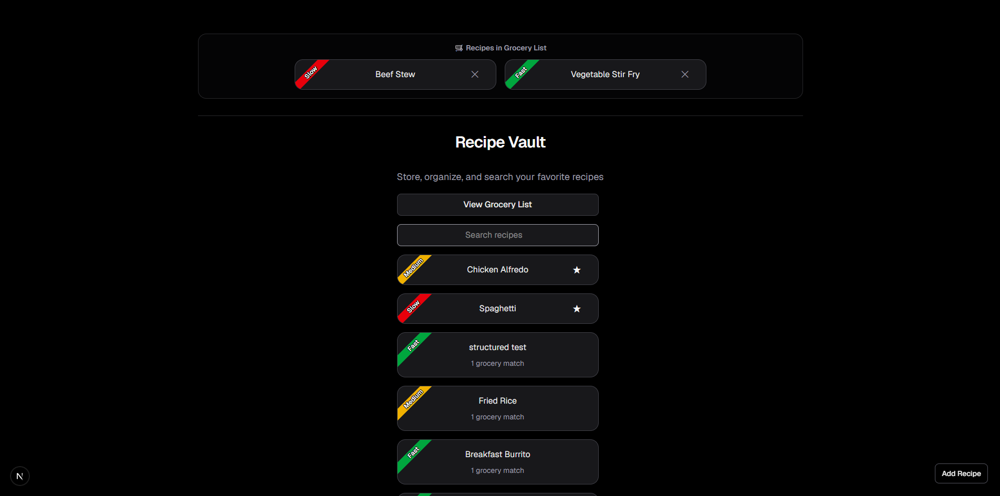
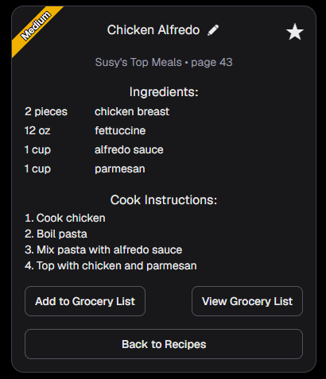
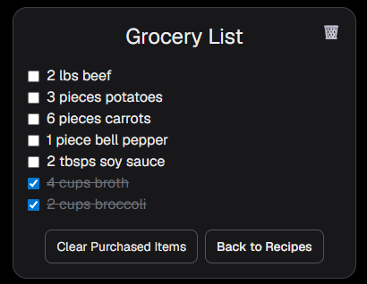
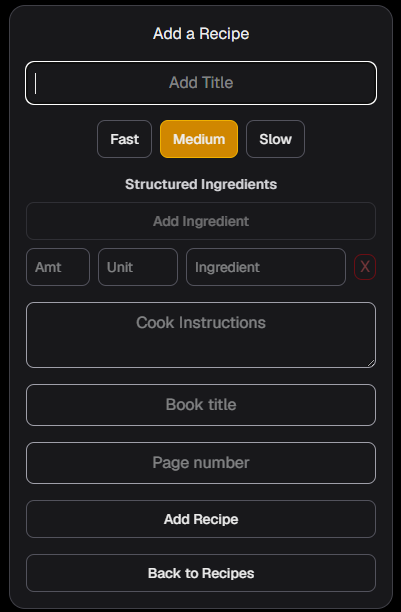

# Recipe Vault

## Overview

Recipe Vault is a recipe management web application built with Next.js, React, TypeScript, and Tailwind CSS.

Users can create, edit, organize, and browse recipes while generating a grocery list directly from recipe ingredients. The application currently uses a hybrid persistence model: recipe CRUD is database-backed through PostgreSQL and Prisma, while favorites and grocery-list state still use browser localStorage. It demonstrates component-based architecture, structured data modeling, dynamic routing, API routes, database modeling, and client-side state management.

## Screenshots

### Homepage



### Recipe Detail



### Grocery List



### Add Recipe



## Running the Project

Install dependencies:

```bash
npm install
```

Create a `.env` file with a PostgreSQL connection string:

```bash
DATABASE_URL="postgresql://..."
```

For local database development with Prisma Postgres, start the database:

```bash
npx prisma dev
```

Apply database migrations:

```bash
npx prisma migrate dev
```

In a separate terminal, start the development server:

```bash
npm run dev
```

Open:

```text
http://localhost:3000
```

in your browser.

## Key Features

### Recipe Management

* Create custom recipes
* Edit existing recipes
* Delete recipes
* Favorite recipes
* Automatic slug generation from recipe titles
* Dynamic recipe detail pages
* Database-backed recipe storage through PostgreSQL and Prisma
* Hybrid display of built-in, database, and existing localStorage recipes during migration

### Structured Ingredient System

Ingredients are stored as structured objects rather than plain text.

```ts
type Ingredient = {
    amount: number | "";
    unit: string;
    name: string;
};
```

This enables:

* Ingredient validation
* Ingredient aggregation
* Flexible ingredient display
* Grocery list generation
* Future measurement-based enhancements

### Grocery List

* Add recipe ingredients to a grocery list
* Remove recipe ingredients from a grocery list
* Individual grocery recipe removal from homepage grocery section
* Persistent grocery list storage
* Persistent grocery recipe tracking
* Prevent duplicate grocery recipe entries
* Grocery ingredient match counting
* Purchased item tracking
* Clear purchased items
* Automatic sorting of checked and unchecked items
* Ingredient aggregation

Example:

```text
1 cup milk
3 cups milk
```

Displays as:

```text
4 cups milk
```

### Search and Organization

* Search recipes by title
* Search recipes by ingredient name
* Search recipes by time category
* Dynamic filtering
* Grocery match indicators
* Favorite recipe prioritization
* Grocery recipe prioritization
* Empty-state messaging

### Recipe Details

* Structured ingredient display
* Cookbook support
* Page number support
* Cook instruction rendering
* Favorite toggling
* Grocery list integration

## Technical Highlights

### Reusable Components

* RecipeCard
* RecipeForm
* SearchBar
* BackButton

### Dynamic Routing

Recipe detail pages are generated using dynamic routes:

```text
/recipes/[slug]
```

### Persistence

The application is currently migrating recipe persistence to PostgreSQL through Prisma and Next.js API routes.

Database-backed behavior currently includes:

* Reading recipes from PostgreSQL
* Creating recipes from the Add Recipe page
* Updating database recipes from the Edit Recipe page
* Deleting database recipes from the Edit Recipe page
* Mapping database records into the application recipe shape

localStorage still persists:

* Favorite recipes
* Grocery lists
* Grocery recipe tracking
* Older custom recipes created before the database migration

During the migration, built-in recipes, localStorage recipes, and database recipes are all shown so existing local data remains visible. The next migration step is an import path for useful localStorage recipes.

### Data Modeling

A structured ingredient model replaced a previous string-based ingredient system, enabling aggregation, validation, and more flexible rendering throughout the application.

### Business Logic Separation

Business logic is separated into reusable service and utility modules rather than embedded directly inside React components. This improves maintainability, testability, and code reuse.

## Technology Stack

* Next.js App Router
* React
* TypeScript
* Tailwind CSS
* Vitest
* PostgreSQL
* Prisma ORM
* Browser localStorage during migration

## Project Structure

```text
app/          Application routes and pages
components/   Reusable React components
data/         Built-in recipe data
hooks/        React hooks for page-level state and behavior
lib/          Application services, storage, validation, and utilities
prisma/       Prisma schema and migrations
tests/        Vitest unit tests
types/        Shared TypeScript types
```

## Architecture

Recipe Vault follows a layered architecture that separates UI rendering, state management, business logic, and utility functions.

```text
UI Components
      ↓
React Hooks
      ↓
Service Layer
      ↓
API Routes / Storage Utilities
      ↓
Prisma / PostgreSQL
```

This separation helps keep components focused, improves testability, and makes business logic reusable across the application.

## Testing

Recipe Vault includes unit tests written with Vitest. Business logic is tested independently of the UI to make refactoring safer and to help prevent regressions as new features are added.

Current test coverage includes:

- Recipe utility functions
- Recipe service functions
- Recipe validation
- Recipe storage helpers
- Favorites and grocery-list behavior
- Database recipe mapping
- Recipe API client behavior
- Recipe create, update, and delete API routes

Tests verify behaviors such as:

- Slug generation
- Ingredient matching
- Recipe sorting
- Homepage section building
- Search filtering
- Form data transformation
- API request and response handling
- Database record mapping

## Future Improvements

* Toast notifications
* Improved measurement conversion and aggregation
* Migrate existing localStorage recipes into PostgreSQL
* Hosted deployment with a production PostgreSQL database
* iPhone Home Screen support
* User accounts
* Cloud synchronization

## Purpose

Recipe Vault is an ongoing portfolio project focused on learning modern web development through incremental feature development, refactoring, and user experience improvements.
