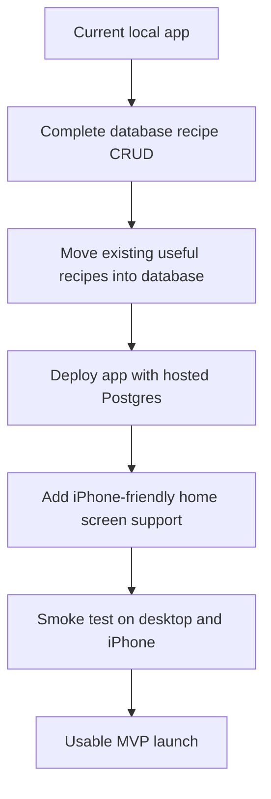

# Recipe Vault Launch Todo

This checklist tracks launch readiness for the first usable version.

Scope assumption: single-user MVP. The app does not need public multi-user scale for v1, but it does need persistent recipe data that works from both desktop browser and iPhone.

## Launch Shape

## Current Status

- [x] PostgreSQL and Prisma are configured locally.
- [x] Recipes can be read from the database.
- [x] Database recipes appear on the homepage.
- [x] Database recipes appear on detail pages.
- [x] Database recipes load into the edit page.
- [x] Database recipes can be updated from the edit page.
- [x] Database recipes can be deleted from the edit page.
- [ ] New recipes are created in the database from the Add Recipe page.
- [ ] Existing localStorage recipes can be imported or migrated into the database.
- [ ] The app is deployed with a hosted Postgres database.
- [ ] The deployed app can be added to an iPhone Home Screen.

## MVP Decisions

- Keep authentication out of the first launch unless private access becomes a hard requirement.
- Use one shared database-backed recipe collection for the first version.
- Keep favorites and grocery list in localStorage for v1 unless cross-device sync becomes required immediately.
- Prefer free hosting/database options first, with clear notes about limits.

## Remaining Todo

### Phase 1: Finish Recipe Database CRUD

- [ ] Add database recipe create API client.
- [ ] Save Add Recipe form submissions to the database.
- [ ] Include database recipes when validating duplicate titles on Add Recipe.
- [ ] Smoke test creating a recipe through the UI.

### Phase 2: Migrate Existing Recipe Data

- [ ] Decide whether built-in/static recipes should stay in code or be imported into the database.
- [ ] Add a one-time localStorage recipe import path.
- [ ] Prevent duplicate imported recipes by slug.
- [ ] Verify migrated recipes can be viewed, edited, and deleted.

### Phase 3: Prepare MVP Deployment

- [ ] Choose a hosted Postgres provider.
- [ ] Create the hosted database.
- [ ] Configure production `DATABASE_URL`.
- [ ] Run production migrations.
- [ ] Deploy the Next.js app.
- [ ] Smoke test homepage, detail page, add, edit, and delete in production.

### Phase 4: iPhone Home Screen Experience

- [ ] Add app metadata for a better Home Screen name and icon.
- [ ] Add a web app manifest if needed.
- [ ] Confirm the deployed site opens well on iPhone Safari.
- [ ] Add the deployed site to the iPhone Home Screen.

### Phase 5: Nice-To-Have After Launch

- [ ] Database-backed favorites.
- [ ] Database-backed grocery list.
- [ ] Authentication and separate user ownership.
- [ ] Better production error messages.
- [ ] Backups/export workflow.

## Free Deployment Notes

- An iPhone Home Screen app still needs a website URL. That means hosting is required unless the app is only used on one local device.
- A normal deployed website can be added to the iPhone Home Screen from Safari.
- To keep desktop and iPhone on the same recipe data, both devices need to use the deployed app connected to the same hosted database.
- Free tiers are reasonable for the first MVP launch, but they may have limits such as storage caps, inactivity pauses, operation limits, or no automatic backups.
